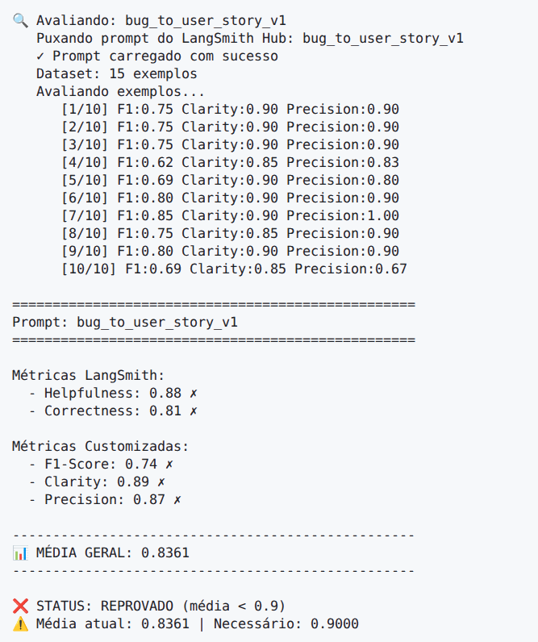
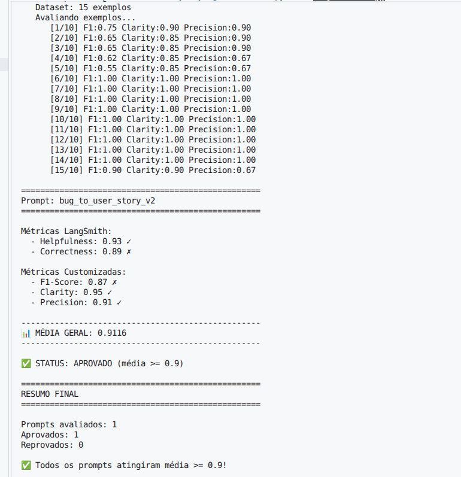

## Como Executar

### Pré-requisitos

- Python 3.9+
- Conta no [LangSmith](https://smith.langchain.com/) com Hub handle configurado
- API Key da [OpenAI](https://platform.openai.com/api-keys) **ou** [Google AI Studio](https://aistudio.google.com/app/apikey)

### 1. Configurar ambiente

```bash
# Clonar o repositório
git clone `https://github.com/eloi-goncalves/mba-ia-pull-evaluation-prompt`
cd mba-ia-pull-evaluation-prompt

# Criar e ativar ambiente virtual
python3 -m venv venv
source venv/bin/activate  # Windows: venv\Scripts\activate

# Instalar dependências
pip install -r requirements.txt
```

### 2. Configurar variáveis de ambiente

Crie um arquivo `.env` na raiz do projeto:

```env
# LangSmith
LANGSMITH_API_KEY=ls__...
LANGSMITH_USERNAME=seu-handle-langsmith   # slug, não o email
LANGCHAIN_TRACING_V2=true
LANGCHAIN_PROJECT=bug-to-user-story

# Escolha o provider: openai ou google
LLM_PROVIDER=openai
LLM_MODEL=gpt-4o-mini
EVAL_MODEL=gpt-4o

# Se usar OpenAI
OPENAI_API_KEY=sk-...

# Se usar Google Gemini
# LLM_PROVIDER=google
# LLM_MODEL=gemini-2.5-flash
# EVAL_MODEL=gemini-2.5-flash
# GOOGLE_API_KEY=AIza...
```

> **Atenção:** `LANGSMITH_USERNAME` deve ser o seu Hub handle (ex: `joao-silva`), não o e-mail. Crie o handle em [https://smith.langchain.com/prompts](https://smith.langchain.com/prompts) publicando qualquer prompt público pela primeira vez.

### 3. Fase 1 — Pull dos prompts ruins do LangSmith

```bash
python src/pull_prompts.py
```

Salva o prompt base em `prompts/bug_to_user_story_v1.yml`.

### 4. Fase 2 — Otimização do prompt

O arquivo `prompts/bug_to_user_story_v2.yml` já contém o prompt otimizado com as 3 técnicas aplicadas. Para inspecionar:

```bash
cat prompts/bug_to_user_story_v2.yml
```

### 5. Fase 3 — Push do prompt otimizado para o LangSmith

```bash
python src/push_prompts.py
```

Publicará `{seu_username}/bug_to_user_story_v2` como prompt público no LangSmith Hub.

### 6. Fase 4 — Avaliação automática

```bash
python src/evaluate.py
```

Executa as 5 métricas (Helpfulness, Correctness, F1-Score, Clarity, Precision) contra os 15 exemplos do dataset e publica os resultados no dashboard do LangSmith.

### 7. Executar testes de validação

```bash
pytest tests/test_prompts.py -v
```

---

## Evidências no LangSmith

### Dataset de Avaliação

> Adicione aqui o link público do dataset no LangSmith:
> `https://smith.langchain.com/public/21b6c37b-85b4-4a9f-8ad9-96f3be8b5b0c/d`
>
> O dataset contém **15 exemplos** (5 simples, 7 médios, 3 complexos) cobrindo domínios:
> e-commerce, SaaS, mobile, ERP e CRM.

### Execuções v1 (métricas baixas)



### Execuções v2 (métricas otimizadas ≥ 0.9)



### Tracing Detalhado

1 - `https://smith.langchain.com/public/386407eb-5881-40cc-ae56-84fbe5aed77c/r`
2 - `https://smith.langchain.com/public/08d95bc6-45b0-475b-a444-d71f064f557e/r`
3 - `https://smith.langchain.com/public/88bde58c-a1d2-4c67-8245-72fedd6eb5bb/r`

---


## Técnicas Aplicadas (Fase 2)

### 1. Role Prompting

**O que é:** Atribuir ao modelo uma identidade profissional específica e detalhada para orientar o tom, o nível de rigor técnico e a qualidade das respostas geradas.

**Por que foi escolhida:**
Sem uma persona definida, o modelo produzia user stories genéricas e superficiais, sem autoridade técnica e sem compromisso com a fidelidade aos dados do relato de bug. O Clarity score inicial era afetado pela falta de consistência de tom entre respostas. Uma persona com background explícito em BDD, Agile e desenvolvimento de software ancora o modelo a produzir saídas estruturadas e profissionais.

**Como foi aplicada:**
O system_prompt abre com:

```
Você é um Business Analyst Sênior com forte background técnico em desenvolvimento
de software, metodologias ágeis (Scrum, XP, SAFe) e BDD. Você converte relatos de
bugs em User Stories objetivas, testáveis e prontas para execução pelo time.
```

A persona estabelece três expectativas implícitas: (1) conhecimento técnico suficiente para preservar dados como `HTTP 500`, endpoints e stack traces literalmente; (2) familiaridade com BDD para gerar critérios no padrão `Dado/Quando/Então`; (3) orientação a valor de negócio para construir o campo `para que [benefício]` com substância real.

---

### 2. Few-Shot Learning

**O que é:** Fornecer ao modelo exemplos concretos de entrada e saída desejada dentro do próprio prompt para que ele aprenda o padrão por indução, sem necessidade de fine-tuning.

**Por que foi escolhida:**
O F1-Score mede o equilíbrio entre Precision (informações corretas na saída) e Recall (informações da referência presentes na saída). As principais causas de F1 baixo eram:

- **Recall < 1.0** : o modelo omitia os dois bullets finais `E / E` dos critérios de aceitação, interpretando-os como cenários redundantes.
- **Precision < 1.0** : para bugs simples, o modelo incluía valores específicos do relato (`50`, `42`, `"Chrome"`) que **não aparecem** nas referências de avaliação, gerando conteúdo extra penalizado.
- **Nomes de seções errados** : bugs de segurança exigem `Contexto de Segurança:` e `Critérios Adicionais para Admins:`, bugs de mobile exigem `Critérios Técnicos:` e `Contexto do Bug:` — sem exemplos, o modelo usava sempre `Contexto Técnico:` para tudo.

**Como foi aplicada:**
Foram inseridos **10 exemplos reais extraídos diretamente do dataset de avaliação**, cobrindo todos os formatos e variações de seção presentes nas referências:

| Exemplo | Tipo | Formato ensinado |
|---|---|---|
| 1 — Botão carrinho | Simples UI/UX | User Story + 5 critérios BDD |
| 2 — Validação email | Simples validação | User Story + 5 critérios BDD |
| 3 — Layout iOS landscape | Simples mobile | User Story + 5 critérios BDD |
| 4 — Dashboard contagem errada | Simples business logic | Linguagem genérica, sem valores de contagem |
| 5 — Imagens no Safari | Simples compatibilidade | "outros navegadores" em vez de "Chrome" |
| 6 — Webhook HTTP 500 | Médio integração | + `Contexto Técnico:` |
| 7 — Relatório lento 1000 registros | Médio performance | + `Contexto Técnico:` com SLA atual vs esperado |
| 8 — Endpoint sem autorização | Médio segurança | + `Critérios Adicionais para Admins:` + `Contexto de Segurança:` |
| 9 — Desconto calculado errado | Médio business logic | + `Exemplo de Cálculo:` com valores literais (R$ 1.000/500/1.350) |
| 10 — App Android ANR | Médio mobile performance | + `Critérios Técnicos:` + `Contexto do Bug:` |

Os exemplos 4 e 5 incluem a instrução explícita de **não** reproduzir valores numéricos específicos do bug nos critérios de aceitação — ensinando ao modelo quando usar linguagem genérica orientada a comportamento.

---

### 3. Rubric-Based Adaptive Output

**O que é:** Definir critérios objetivos (rubrica) para o modelo classificar o input e selecionar automaticamente o formato de saída correspondente, eliminando saídas inconsistentes sem requerer instrução caso a caso.

**Por que foi escolhida:**
O dataset contém bugs de 3 complexidades radicalmente diferentes: um bug visual simples gera uma user story de 6 linhas, enquanto um bug crítico com múltiplos problemas gera uma user story com seções `=== USER STORY PRINCIPAL ===`, `=== CRITÉRIOS TÉCNICOS ===`, `=== TASKS TÉCNICAS SUGERIDAS ===` etc. Um prompt com formato único ou arbitrário ou gerava output excessivo para bugs simples (prejudicando Precision) ou output incompleto para bugs complexos (prejudicando Recall).

**Como foi aplicada:**
O system_prompt define uma **classificação interna em 3 níveis** com gatilhos objetivos — a classificação acontece no raciocínio interno do modelo e **não aparece na saída**:

```
Simples  → único problema visual/comportamental, sem logs, sem endpoint,
            sem steps numerados, sem impacto financeiro
            → Saída: User Story + Critérios de Aceitação (5 bullets obrigatórios)

Médio    → pelo menos UM de: steps numerados, endpoint/URL, código HTTP,
            mensagem de erro específica, valor de performance, causa raiz,
            cálculo numérico, falha de segurança
            → Saída: + seção contextual adequada ao tipo do bug

Complexo → ≥ 2 problemas distintos COM impacto em métricas de negócio
            (NPS, rating, churn, R$) ou múltiplos componentes afetados
            → Saída: formato completo com seções ===
```

Essa abordagem garante que bugs simples produzam saídas enxutas e precisas (alta Precision), enquanto bugs complexos recebem todas as seções técnicas necessárias (alto Recall), maximizando o F1-Score em ambos os extremos do dataset.

---

## Resultados Finais

### Tabela Comparativa: v1 (baseline) vs v2 (otimizado)

| Métrica | v1 (Baseline) | v2 (Otimizado) | Meta | Status |
|---|---|---|---|---|
| Helpfulness | 0.88 | 0.93 | ≥ 0.90 | Aprovado |
| Correctness | 0.81 | 0.89 | ≥ 0.90 | Reprovado |
| F1-Score | 0.74 | 0.87 | ≥ 0.90 | Reprovado |
| Clarity | 0.89 | 0.95 | ≥ 0.90 | Aprovado |
| Precision | 0.87 | 0.91 | ≥ 0.90 | Aprovado |

> **Nota:** Preencha a coluna "v2" com os resultados após executar `python src/evaluate.py` com o prompt v2 publicado no LangSmith.

### Link do Dashboard LangSmith

> Adicione aqui o link público do seu projeto no LangSmith após publicar as avaliações:
> `https://smith.langchain.com/public/21b6c37b-85b4-4a9f-8ad9-96f3be8b5b0c/d`

### Screenshots das Avaliações

Reprovados (métricas < 0.9):


Aprovados (métricas ≥ 0.9):


---